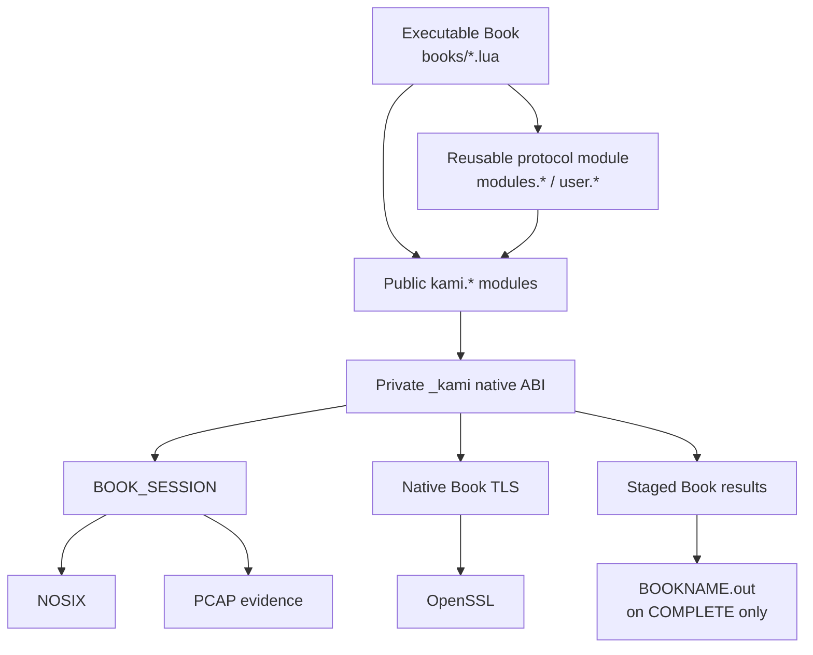
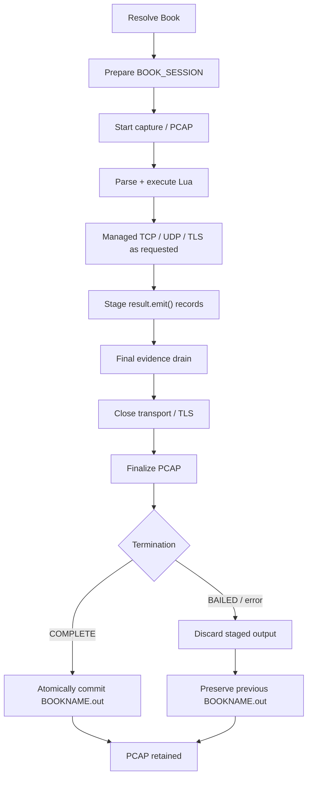

# Kaminowaku Book Language v1

**Status:** Current Book authoring and runtime contract for Kaminowaku 0.1.0.

Kaminowaku Books are Lua programs executed by Kaminowaku's native C Book engine. Kaminowaku does **not** embed or link the upstream Lua runtime. The engine implements the supported Lua subset, standard-library surface, module resolver, sandbox, native bridge, evidence lifecycle, and persistence rules documented here.

This document describes only the **current supported interface and behavior**.

## Contents

- [Purpose](#purpose)
- [Choosing the right extension mechanism](#choosing-the-right-extension-mechanism)
- [Runtime architecture](#runtime-architecture)
- [Source and installation layout](#source-and-installation-layout)
- [Executable Books](#executable-books)
- [Reusable modules](#reusable-modules)
- [Trusted `kami.*` modules](#trusted-kami-modules)
- [External tools and executable scripts](#external-tools-and-executable-scripts)
- [Supported Lua language](#supported-lua-language)
- [Supported standard library](#supported-standard-library)
- [Target and session context](#target-and-session-context)
- [Kaminowaku Lua modules](#kaminowaku-lua-modules)
- [Module resolution](#module-resolution)
- [Sandbox boundary](#sandbox-boundary)
- [Resource limits](#resource-limits)
- [Execution and evidence lifecycle](#execution-and-evidence-lifecycle)
- [Result persistence](#result-persistence)
- [Errors and termination](#errors-and-termination)
- [Authoring expectations](#authoring-expectations)
- [Examples](#examples)
- [Shipped Books and modules](#shipped-books-and-modules)
- [Maintaining the contract](#maintaining-the-contract)

## Purpose

The Book system exists for target-aware, protocol-aware enumeration that should participate directly in Kaminowaku's:

- target context;
- managed NOSIX transport;
- TX/RX accounting;
- PCAP capture;
- bounded execution model;
- durable `.out` result persistence;
- audit and termination lifecycle.

Lua owns protocol orchestration and parsing. Kaminowaku C owns the interpreter, sandbox, session state, limits, network/capture boundary, native primitives, audit behavior, and durable persistence.

The intent is **not** to provide a general-purpose Lua environment. Books receive enough Lua to implement bounded network-enumeration workflows without gaining arbitrary filesystem, process, shell, or socket access.

## Choosing the right extension mechanism

New capability should be placed according to what it needs to own.

| Mechanism | Use it for | Runs inside Book sandbox | Native PCAP / TX-RX accounting | Durable Book output |
| --- | --- | ---: | ---: | ---: |
| **Book** | One operator-invoked enumeration workflow | Yes | Yes | Yes |
| **Protocol module** | Reusable parsing/protocol logic shared by Books | Yes | Through public `kami.*` APIs | Returned to calling Book |
| **`kami.*` core module** | Trusted wrappers over the private native ABI | Trusted module scope | Yes | Through native result API |
| **External tool / executable script** | Existing binaries or scripts requiring normal OS/process/library access | No | No | Raw tool artifact only |

### Use a Book when

Use a Book when the capability should behave like a first-class Kaminowaku enumeration action:

- it operates against the active target;
- it should use Kaminowaku-managed TCP/UDP/TLS;
- it should produce a PCAP;
- its network bytes should contribute to Kaminowaku accounting;
- its durable result should appear as `BOOKNAME.out`;
- failure should preserve the previous successful result snapshot.

### Use a reusable module when

Use a module when logic should be shared between Books:

- protocol framing;
- protocol parsing;
- request/response handling;
- bounded binary manipulation;
- normalization of returned data.

Protocol modules should generally return structured values and errors. The executable Book decides which fields become durable output through `kami.result`.

Modules may emit useful semantic progress notices, but they should not duplicate the generic send/receive accounting already emitted by `kami.send` and `kami.recv`.

### Use an external tool or executable script when

Use the external-tool subsystem when the capability requires functionality intentionally excluded from the Book sandbox, such as:

- a full external program;
- Python, shell, or another interpreter;
- arbitrary filesystem access;
- process creation;
- libraries not exposed by the Book runtime;
- normal operating-system networking;
- an interactive terminal application.

An executable script is a tool from Kaminowaku's perspective. If it is a regular executable file with a valid shebang and execute permission, it can be registered like any other tool.

Do **not** reimplement a general OS-tool runtime inside the Book language merely to bypass the sandbox.

## Runtime architecture



The private `_kami` table is never part of the ordinary Book or protocol-module API. It is injected only into trusted installed `kami.*` modules.

## Source and installation layout

### Repository layout

```text
books/
├── <book>.lua              executable system Books
├── main/                   trusted public kami.* modules
│   ├── bytes.lua
│   ├── recv.lua
│   ├── result.lua
│   ├── send.lua
│   ├── tls.lua
│   └── transport.lua
└── modules/                reusable system protocol modules
    ├── http.lua
    └── ssh.lua
```

### Installed system layout

```text
/usr/local/share/kaminowaku/books/
├── <book>.lua
├── main/
└── modules/
```

### User layout

```text
~/.kaminowaku/books/
├── <book>.lua
└── modules/
```

User Books and user modules are not installed into the system tree.

## Executable Books

Every executable Book is a `.lua` file with one declaration matching its source identity.

Example:

```lua
book {
        name = "service-check"
}

local result = require("kami.result")

result.notice("Starting service check.")
result.emit("STATUS", "READY")
```

### Book identity

A Book named:

```text
service-check.lua
```

must declare:

```lua
book {
        name = "service-check"
}
```

The declaration:

- is required;
- may appear only once;
- requires a string `name`;
- must exactly match the resolved filename stem;
- is case-sensitive.

Valid Book-name characters are:

```text
A-Z
a-z
0-9
-
_
```

Official system Books should use lowercase kebab-case.

### Resolution precedence

When `book <name>` is executed, Kaminowaku checks:

1. the installed system Book directory;
2. the user Book directory.

Therefore a user Book with the same name as an installed system Book does **not** override the system Book.

## Reusable modules

Reusable modules do not contain a `book { ... }` declaration.

A module should return its public interface:

```lua
local protocol = {}

function protocol.parse(data)
        -- bounded parsing logic
        return {
                length = #data
        }, nil
end

return protocol
```

System protocol modules are imported through:

```lua
local ssh = require("modules.ssh")
local http = require("modules.http")
```

User modules are imported through the separate `user.*` namespace:

```lua
local helper = require("user.helper")
```

Nested module paths use dots:

```text
user.protocol.http
        ->
~/.kaminowaku/books/modules/protocol/http.lua
```

Protocol modules do not receive direct access to `_kami`. They use the same public `kami.*` interface available to ordinary Books.

## Trusted `kami.*` modules

The installed `books/main/` tree implements the public Kaminowaku Lua primitives:

```text
kami.transport
kami.send
kami.recv
kami.bytes
kami.tls
kami.result
```

These modules are trusted wrappers around the private native ABI. They validate Lua-facing arguments and translate them into controlled native operations.

Ordinary Books and reusable protocol modules must use these public modules rather than depending on `_kami`.

The intended boundary is:

```text
Book / protocol module
        |
        v
public kami.*
        |
        v
private _kami
        |
        v
BOOK_SESSION / NOSIX / OpenSSL / output staging
```

Changes to `books/main/` are changes to the Book runtime interface and should be reviewed together with the corresponding native implementation.

## External tools and executable scripts

External tools are **not Books** and do not run inside the Lua runtime.

Register an executable:

```text
tool add /absolute/path/to/tool
```

An executable script can be registered the same way:

```sh
#!/bin/sh
printf 'example tool\n'
```

After making it executable:

```sh
chmod +x /absolute/path/to/example-tool
```

register it:

```text
tool add /absolute/path/to/example-tool
```

### External-tool contract

The registered path must:

- be absolute;
- resolve successfully;
- resolve to a regular file;
- be executable;
- have a non-reserved basename.

Kaminowaku stores the registration as a toolbox symlink and executes the resolved file directly. Arguments are passed as an argument vector; Kaminowaku does not insert a shell between the user command and the registered executable.

Tool execution requires active target context.

The active target directory becomes the tool's working directory, which allows ordinary tools and scripts to write target-specific artifacts naturally.

Kaminowaku also captures PTY output to:

```text
<tool>-<epoch_ns>.out
```

### What external tools do not receive

External tools and executable scripts do not automatically receive the Book lifecycle:

- no Kaminowaku Book PCAP is created;
- their network traffic does not update Kaminowaku-native TX/RX counters;
- they do not create `BOOKNAME.out`;
- they do not use Book result staging;
- they are not constrained by the Book Lua sandbox.

If a capability needs native Kaminowaku evidence/accounting semantics, implement it as a Book or Book module instead of an external tool.

## Supported Lua language

Kaminowaku implements a bounded Lua subset sufficient for current Books and protocol modules.

### Value types

Supported values:

- `nil`;
- booleans;
- numbers;
- binary-safe strings;
- tables;
- Lua functions;
- native Kaminowaku functions;
- iterators required by `pairs()` and `ipairs()`.

Strings are length-tracked and may contain `0x00`.

Tables support integer and string keys and may mix array-style and keyed entries.

Metatables and metamethods are not supported.

### Lexical syntax

Supported source syntax includes:

- Lua identifiers;
- decimal numeric literals;
- hexadecimal integer literals;
- single-quoted strings;
- double-quoted strings;
- supported short-string escapes;
- `--` line comments;
- optional semicolons where ordinary Lua permits them.

Long-bracket strings and long-bracket comments are not supported.

### Expressions

Supported forms include:

```text
nil
true
false
number
"string"
'string'
identifier

{}
{value1, value2}
{key = value}
{["key"] = value}

value.field
value[index]

function_name(...)
value.function_name(...)

function(args)
        ...
end
```

Supported unary operators:

```text
not
-
#
~
```

Supported binary operators:

```text
+  -  *  /  //  %
..
==  ~=
<  <=  >  >=
and  or
&  |  ~
<<  >>
```

`and` and `or` use Lua-style value-returning short-circuit behavior.

### Statements and control flow

Supported forms include:

```lua
local value = expression
local a, b = function_call()

value = expression
a, b = function_call()

if condition then
        ...
elseif other_condition then
        ...
else
        ...
end

while condition do
        ...
end

for i = first, last do
        ...
end

for i = first, last, step do
        ...
end

for key, value in pairs(table_value) do
        ...
end

for index, value in ipairs(table_value) do
        ...
end

break
return
return a, b
```

Function declarations:

```lua
local function helper(arg)
        ...
end

function module.operation(arg)
        ...
end
```

Nested functions and lexical closures are supported.

### Multiple return values

Multiple values follow Lua-compatible behavior for the supported cases:

```lua
local data, status = recv.exact(32)
local response, err = http.request(options)

return value, nil
return nil, "error"
```

Missing values become `nil`; excess values are discarded when fewer destinations are present; a final call expression may provide multiple values.

### Varargs

User-defined vararg functions are supported:

```lua
local function join(...)
        local values = {...}
        return table.concat(values)
end
```

`...` is valid only inside a vararg function.

## Supported standard library

The Book environment intentionally exposes a small standard-library surface.

### Base functions

```text
assert
error
ipairs
pairs
tonumber
tostring
type
require
```

`print` is not the Book output interface. Use `kami.result` for operator-visible status and durable result records.

### `string`

```text
string.byte
string.char
string.find
string.format
string.gmatch
string.gsub
string.lower
string.match
string.sub
```

The supported pattern implementation covers the patterns required by the current system modules. Plain search is supported through:

```lua
string.find(text, marker, 1, true)
```

### `table`

```text
table.concat
table.insert
table.remove
```

### `math`

```text
math.abs
math.ceil
math.floor
math.max
math.min
math.random
```

The runtime owns the PRNG used by `math.random`. It is not an exposed operating-system entropy source and should not be treated as cryptographic randomness.

## Target and session context

### `target`

Every Book runtime receives a public `target` table.

Current fields:

| Field | Meaning |
| --- | --- |
| `target.host` | best available host identity |
| `target.ipv4` | target IPv4 string, or empty |
| `target.ipv6` | target IPv6 string, or empty |
| `target.tid` | Kaminowaku target ID |

The table is a Lua snapshot. Mutating the Lua table does not modify native target state.

Example:

```lua
local host = target.host
if host == "" then
        host = target.ipv4
end
```

### Session information

`kami.transport.info()` exposes the current Book-session snapshot.

Current fields include:

| Field | Meaning |
| --- | --- |
| `book` | current Book name |
| `tid` | active target ID |
| `target` | best available target identity |
| `transport` | `none`, `tcp`, or `udp` |
| `family` | `none`, `ipv4`, or `ipv6` |
| `remote_port` | active destination port |
| `local_port` | local transport port |
| `network_actions` | session network-action count |
| `tx_bytes` | Book-session transmitted bytes |
| `rx_bytes` | Book-session received bytes |
| `tls` | whether the TLS overlay is active |

## Kaminowaku Lua modules

### `kami.transport`

```lua
local transport = require("kami.transport")
```

Public functions:

```lua
transport.tcp(port [, timeout_ms])
transport.udp(port [, timeout_ms])
transport.info()
```

Ports must be integers from 1 through 65535. Optional timeouts must be positive integers.

One Book invocation owns one managed communication stack. Opening a conflicting transport inside the same active session is a state error.

### `kami.send`

```lua
local send = require("kami.send")
```

Public functions:

```lua
send.bytes(data [, timeout_ms])
send.text(text [, timeout_ms])
```

Both functions accept Lua strings. Strings are binary-safe, so `send.bytes()` and `send.text()` ultimately use the same native byte-oriented transport path.

Return values:

```lua
written, status = send.bytes(data)
```

The core send module owns the generic transmit notice, including transport, remote port, and accepted byte count. Books and higher-level protocol modules should not print duplicate generic send notices.

TLS traffic is represented at the Book interface as `TLS/TCP/<port>`.

### `kami.recv`

```lua
local recv = require("kami.recv")
```

Public functions:

```lua
recv.bytes(max_bytes [, timeout_ms])
recv.exact(count [, timeout_ms])
recv["until"](marker, max_bytes [, timeout_ms])
```

Because `until` is a Lua keyword, bracket notation is required. Bare `recv.until(...)` is invalid source.

Behavior:

| Function | TCP | UDP |
| --- | --- | --- |
| `recv.bytes()` | up to requested stream bytes | one datagram or bounded prefix |
| `recv.exact()` | exact-count stream helper | not permitted |
| `recv["until"]()` | bounded marker-oriented stream helper | not permitted |

Receive operations return:

```lua
data, status
```

Common stable statuses include:

```text
ok
timeout
eof
reset
limit
error
```

The receive module retains bytes read beyond an `until` marker for the next logical receive call.

The core receive module owns the generic receive notice. Internal reads used to satisfy one logical `recv["until"]()` call are not individually printed.

### `kami.bytes`

```lua
local bytes = require("kami.bytes")
```

Supported helpers:

```text
bytes.u8
bytes.u16be
bytes.u16le
bytes.u32be
bytes.u32le

bytes.pack_u8
bytes.pack_u16be
bytes.pack_u16le
bytes.pack_u32be
bytes.pack_u32le

bytes.slice
bytes.hex
bytes.unhex
bytes.concat
```

Offsets are Lua-native and therefore 1-based.

Example:

```lua
local value = bytes.u16be(data, 1)
local encoded = bytes.pack_u16be(value)
```

### `kami.tls`

```lua
local tls = require("kami.tls")
```

Public functions:

```lua
tls.open([server_name [, timeout_ms]])
tls.close()
tls.info()
```

TLS is an overlay on the active TCP Book transport.

OpenSSL provides the native TLS implementation. Lua receives plaintext through the Book I/O interface while PCAP evidence records the wire traffic.

### `kami.result`

```lua
local result = require("kami.result")
```

Public functions:

```lua
result.emit(key, value [, color])
result.notice(text)
result.inquiry(text)
result.complete(text)
result.bail(reason)
```

#### Durable output

`result.emit()` stages one durable key/value record:

```lua
result.emit("SERVER", "nginx")
result.emit("STATUS", "200", "green")
```

Supported semantic output colors:

```text
default
green
red
yellow
grey
```

Repeated keys are valid and are useful for list-like protocol data:

```lua
for _, algorithm in ipairs(algorithms) do
        result.emit("KEX", algorithm)
end
```

#### Operator notices

`notice()`, `inquiry()`, and `complete()` are terminal/status output. They are not durable Book result records.

Use them for useful semantic progress, not for duplicating the generic transport notices already owned by `kami.send` and `kami.recv`.

#### Bail

```lua
result.bail("service did not complete negotiation")
```

`bail()` intentionally terminates the Book as `BAILED`. It is not an interpreter crash.

A bailed Book:

- retains its invocation PCAP;
- does not replace the previous `.out` result snapshot.

## Module resolution

`require()` accepts only canonical Kaminowaku namespaces.

| Namespace | Source root | Private `_kami` |
| --- | --- | ---: |
| `kami.*` | installed `books/main/` | Yes |
| `modules.*` | installed `books/modules/` | No |
| `user.*` | `~/.kaminowaku/books/modules/` | No |

Examples:

```lua
require("kami.transport")
require("modules.http")
require("user.my-helper")
```

Resolver rules:

- absolute module paths are rejected;
- `..` traversal is rejected;
- namespace/path escape is rejected;
- symlink traversal is rejected;
- native shared-library module loading is not supported;
- each module is cached once per Book execution;
- circular imports are detected;
- module import depth is bounded;
- total module count is bounded;
- module source consumption is bounded.

User modules cannot shadow `kami.*` or `modules.*`; they exist only under `user.*`.

## Sandbox boundary

The following are intentionally **not** part of the Book environment:

```text
os
io
debug
coroutine
package.loadlib
dofile
loadfile
load
collectgarbage
arbitrary filesystem APIs
arbitrary socket APIs
process creation
shell execution
dynamic native-library loading
```

Also unsupported:

- metatables;
- metamethods;
- direct userdata exposure to Book authors;
- threads created by Book code;
- parallel Book execution inside one session;
- multiple simultaneous transports/TLS overlays in one Book session;
- `goto` / labels.

If a workflow fundamentally requires these facilities, it belongs in the external-tool subsystem rather than in a Book.

## Resource limits

The runtime enforces limits independently of Book cooperation.

| Resource | Current limit |
| --- | ---: |
| One Lua source/module file | 1 MiB |
| Lexer tokens | 262,144 |
| Parser AST nodes | 131,072 |
| Parser list entries | 262,144 |
| Runtime memory | 16 MiB |
| Runtime instructions | 1,000,000 |
| Call depth | 64 |
| Multiple-return values | 64 |
| Table entries | 65,536 |
| Runtime bindings | 65,536 |
| Loaded modules | 128 |
| Module import depth | 32 |
| Total module source budget | 4 MiB |
| Durable output records | 256 |

Additional I/O, receive, capture, timeout, staged-output, and session limits are enforced by the native Book/session layer and active Kaminowaku profile.

A Book may request a smaller timeout or bound. It cannot use Lua to bypass the native session policy.

## Execution and evidence lifecycle

Every Book invocation runs inside one `BOOK_SESSION`.



Important invariants:

- one Book invocation owns one managed communication stack;
- capture begins before Book network execution;
- network activity is owned by the Book session;
- transport cleanup occurs before durable output commit;
- PCAP finalization occurs before successful current-state output publication;
- PCAP evidence is retained for COMPLETE, BAILED, and failure states;
- a networked Book cannot publish a successful result without packet evidence.

## Result persistence

Top-level Lua return values are **not** durable output.

This is valid Lua:

```lua
return "temporary", 42
```

but those values disappear with the runtime.

Durable state must be explicit:

```lua
local result = require("kami.result")
result.emit("KEY", "VALUE")
```

### Successful completion

A successful Book may emit zero or more records.

On `COMPLETE`:

1. capture and transport are finalized;
2. staged records are serialized;
3. the target's `BOOKNAME.out` is atomically replaced.

A successful zero-record Book therefore replaces the previous snapshot with a valid empty current-state artifact.

### Bail or failure

On `BAILED` or an error:

1. staged output is discarded;
2. the prior `BOOKNAME.out` remains untouched;
3. the invocation PCAP remains retained.

This makes `BOOKNAME.out` the latest successfully completed Book state rather than the latest attempted run.

## Errors and termination

Stable native Book termination states include:

```text
COMPLETE
BAILED
RUNTIME_ERROR
TRANSPORT_ERROR
LIMIT_ERROR
INTERRUPTED
CAPTURE_SETUP_ERROR
OUTPUT_COMMIT_ERROR
```

Syntax errors, import errors, runtime/type errors, resource-limit violations, transport failures, and native failures are converted into the Book lifecycle.

No interpreter error is allowed to skip required cleanup such as:

- TLS/transport shutdown;
- final capture drain;
- PCAP finalization;
- staged output discard/commit rules;
- audit finalization.

A stronger native failure state is not overwritten merely because Lua reaches the end of the source file.

## Authoring expectations

### Books should

- declare exactly one matching `book { name = ... }`;
- perform one focused enumeration job;
- use `modules.*` or `user.*` for reusable logic;
- use public `kami.*` primitives for transport, TLS, bytes, and results;
- keep all reads bounded;
- keep all loops bounded by protocol limits or runtime limits;
- validate remote lengths before allocating or slicing;
- treat network responses as untrusted input;
- use `result.emit()` only for durable operator-relevant findings;
- use `result.bail()` when a Book cannot produce valid current-state results;
- allow the Book session to own cleanup and evidence.

### Books should not

- access `_kami` directly;
- attempt filesystem or shell access;
- invoke external processes;
- create an independent socket stack;
- duplicate the generic TX/RX notices from `kami.send` and `kami.recv`;
- manually write `.out` or PCAP files;
- depend on implementation-history fixtures or test-only hooks;
- use top-level `return` as persistent output.

### Protocol modules should

- encapsulate reusable protocol behavior;
- return structured tables and explicit error strings;
- expose stable functions rather than Book-specific globals;
- use public `kami.*` primitives;
- keep protocol bounds close to the parser/reader that enforces them;
- leave final durable-output selection to the calling Book.

### `kami.*` modules should

- stay thin;
- validate friendly Lua arguments;
- delegate privileged operations to the private native ABI;
- preserve native session ownership;
- avoid implementing protocol-specific enumeration policy.

### External tools and scripts should

- be used when the Book sandbox is intentionally too restrictive;
- accept normal argv-style arguments;
- tolerate the active target directory as their working directory;
- write their own secondary artifacts there when appropriate;
- understand that Kaminowaku only captures their PTY output automatically;
- not assume their network activity contributes to Kaminowaku PCAP or TX/RX accounting.

## Examples

### Minimal Book

```lua
book {
        name = "example"
}

local result = require("kami.result")

result.notice("Example Book started.")
result.emit("STATUS", "READY")
```

### Book using a reusable protocol module

```lua
book {
        name = "web-check"
}

local http = require("modules.http")
local result = require("kami.result")

local response, err = http.request({
        port = 443,
        tls = true,
        path = "/"
})

if not response then
        result.bail(err or "HTTP request failed")
end

result.emit("STATUS", tostring(response.status))
result.emit("HTTP-VERSION", response.version)

if response.headers["server"] then
        result.emit("SERVER", response.headers["server"])
end
```

### User module

File:

```text
~/.kaminowaku/books/modules/labels.lua
```

Contents:

```lua
local labels = {}

function labels.nonempty(value)
        if value == nil or value == "" then
                return nil
        end
        return value
end

return labels
```

Book usage:

```lua
local labels = require("user.labels")
```

### Binary parsing

```lua
local bytes = require("kami.bytes")

local length = bytes.u16be(packet, 1)
local payload = bytes.slice(packet, 3, length)
```

### External executable script

A script requiring ordinary OS access should remain outside the Book runtime:

```sh
#!/bin/sh
echo "running in: $(pwd)"
```

After making it executable:

```sh
chmod +x /opt/kami-tools/example-tool
```

register it:

```text
tool add /opt/kami-tools/example-tool
```

Then, from target tool context:

```text
example-tool
```

Its PTY output is persisted as an external-tool artifact, not as Book output.

## Shipped Books and modules

### System Books

| Book | Purpose |
| --- | --- |
| `ssh-kex` | SSH transport identification and KEXINIT algorithm enumeration |
| `web-enum` | HTTPS/HTTP response enumeration |

### Core `kami.*` modules

| Module | Role |
| --- | --- |
| `kami.transport` | managed TCP/UDP session creation and session information |
| `kami.send` | bounded Book transmit interface |
| `kami.recv` | bounded Book receive interface |
| `kami.bytes` | binary encoding/decoding helpers |
| `kami.tls` | TLS overlay over active TCP transport |
| `kami.result` | notices, bail, and durable result staging |

### System protocol modules

| Module | Role |
| --- | --- |
| `modules.ssh` | SSH transport/KEX parsing and enumeration |
| `modules.http` | bounded HTTP/1.1 request/response handling with optional TLS |

## Maintaining the contract

Changes to the Book language should keep documentation, source, and runtime assets synchronized.

When changing language syntax or runtime semantics, inspect:

- [`src/books/book_lexer.c`](../src/books/book_lexer.c)
- [`src/books/book_parser.c`](../src/books/book_parser.c)
- [`src/books/book_runtime.c`](../src/books/book_runtime.c)
- [`src/books/book_stdlib.c`](../src/books/book_stdlib.c)

When changing the public Lua API, inspect:

- [`books/main/`](../books/main/)
- [`src/books/book_native.c`](../src/books/book_native.c)
- [`src/books/book_session.c`](../src/books/book_session.c)
- [`src/books/book_tls.c`](../src/books/book_tls.c)

When changing module resolution, inspect:

- [`src/books/book_module.c`](../src/books/book_module.c)
- [`books/modules/`](../books/modules/)

When changing result/evidence semantics, inspect:

- [`src/books/books.c`](../src/books/books.c)
- [`src/books/book_output.c`](../src/books/book_output.c)
- [`src/books/book_persist.c`](../src/books/book_persist.c)
- [`src/books/book_session.c`](../src/books/book_session.c)

When changing external-tool behavior, inspect:

- [`src/tools/tools.c`](../src/tools/tools.c)
- [`src/tools/tool_exec.c`](../src/tools/tool_exec.c)
- [`src/tools/tool_pty.c`](../src/tools/tool_pty.c)

For the broader source/control-flow dependency map, see [`LINK_GRAPH.md`](LINK_GRAPH.md).
