# Kaminowaku Link Graph

This document maps the current Kaminowaku source tree, subsystem boundaries, control flow, and direct internal source relationships.

It is a **maintainer reference for the current implementation on `main`**. It describes how the active codebase is connected; it is not a historical design document and does not describe retired architecture.

## Contents

- [How to read this document](#how-to-read-this-document)
- [Repository map](#repository-map)
- [Primary control flow](#primary-control-flow)
- [Command dispatch](#command-dispatch)
- [Shared state and NOSIX boundary](#shared-state-and-nosix-boundary)
- [Project and profile lifecycle](#project-and-profile-lifecycle)
- [Network execution paths](#network-execution-paths)
- [Port-scan path](#port-scan-path)
- [Book execution path](#book-execution-path)
- [External-tool path](#external-tool-path)
- [Persistence and evidence](#persistence-and-evidence)
- [UI and rendering path](#ui-and-rendering-path)
- [Build-time link path](#build-time-link-path)
- [Implementation link index](#implementation-link-index)
- [Change-impact guide](#change-impact-guide)
- [External dependency boundary](#external-dependency-boundary)

## How to read this document

Kaminowaku has two different kinds of links:

1. **Control-flow links** — one runtime component dispatches into or owns another component.
2. **Source links** — one implementation file directly includes another Kaminowaku header.

The diagrams emphasize runtime ownership and control flow. The implementation index records direct local include relationships.

> The build projects headers into `.STAGE/include/`, so C source files normally include local headers by basename rather than repository-relative path.

Paths in this document are relative to the repository root.

## Repository map

```text
kaminowaku/
├── books/                  Book source and reusable Lua modules
│   ├── main/               Trusted public kami.* modules
│   ├── modules/            Reusable protocol modules
│   ├── ssh-kex.lua
│   └── web-enum.lua
├── docs/
│   ├── BOOK_LANGUAGE_V1.md
│   └── LINK_GRAPH.md
├── src/
│   ├── books/              Book parser/runtime/session/persistence
│   ├── command/            Command dispatch and help
│   ├── network/
│   │   ├── interfaces/     Interface discovery
│   │   ├── ping/           ICMPv4/ICMPv6
│   │   ├── resolve/        DNS resolution
│   │   └── scan/           Scan transport, dispatch, workers, ports
│   ├── profile/            Global profile parsing and mutation
│   ├── projects/           Project lifecycle and NOSIX lifecycle
│   ├── targets/            Target model, persistence, context, display
│   ├── tools/              External-tool registration and execution
│   ├── ui/                 Input, renderer, banner
│   ├── data.h              Shared program state and core data model
│   ├── helpers.c
│   ├── helpers.h
│   ├── kaminowaku.c        Main runtime/state-machine loop
│   ├── kaminowaku.h
│   └── main.c              Process entrypoint
├── default.ini             Shipped global profile
├── Makefile
├── install.sh
├── uninstall.sh
├── README.md
└── LICENSE.txt
```

## Primary control flow

The main runtime path is intentionally narrow at the top and fans out only after command classification.

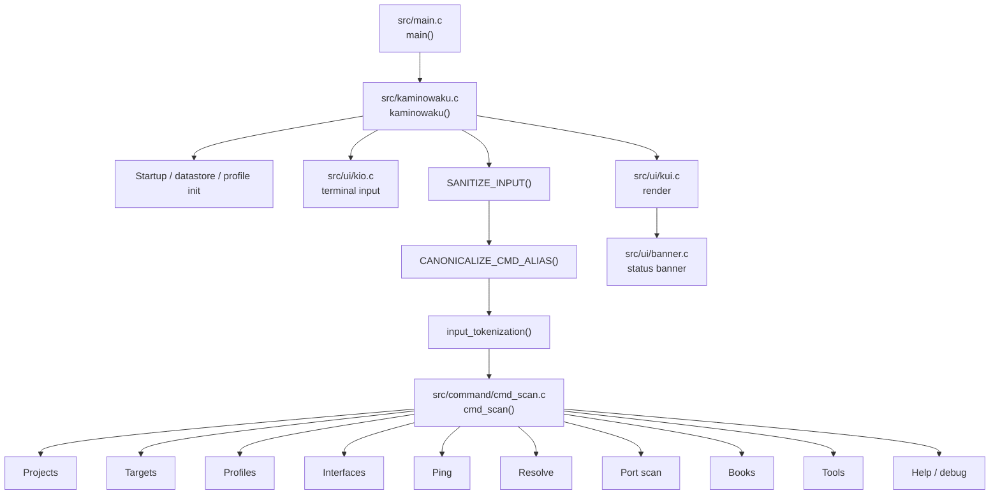

The process-level loop is:

```text
main()
  -> initialize _carry_forward
  -> while (kaminowaku(&_prog_data))
       -> startup handling when S_STARTUP
       -> render/input cycle
       -> sanitize input
       -> canonicalize aliases
       -> tokenize
       -> dispatch through cmd_scan()
       -> return to current context
```

The current context is represented by `_prog_data->f_type`. It controls whether input is interpreted at the project/default level, target level, tool level, or a temporary contextual prompt.

## Command dispatch

`src/command/cmd_scan.c` is the primary user-command fan-out point.

| User operation | Primary implementation | Major next hop |
| --- | --- | --- |
| `help` | [`src/command/help.c`](../src/command/help.c) | UI renderer |
| `new` / `load` / `unload` | [`src/projects/projects.c`](../src/projects/projects.c) | project storage + NOSIX lifecycle |
| `targets` / `set` / `display` | [`src/targets/targets.c`](../src/targets/targets.c) | target model, scan display, Book output |
| `profile` | [`src/profile/profile.c`](../src/profile/profile.c) | [`gprofile.c`](../src/profile/gprofile.c), project NOSIX reopen |
| `interfaces` | [`src/network/interfaces/interfaces.c`](../src/network/interfaces/interfaces.c) | OS interface enumeration |
| `ping` | [`src/network/ping/ksping.c`](../src/network/ping/ksping.c) / [`ksping6.c`](../src/network/ping/ksping6.c) | KWIRE / NOSIX |
| `resolve` | [`src/network/resolve/kresolve.c`](../src/network/resolve/kresolve.c) | KWIRE / NOSIX |
| `scan` | [`src/network/scan/ports/kportscan.c`](../src/network/scan/ports/kportscan.c) | TCP/UDP scan engines |
| `book` | [`src/books/books.c`](../src/books/books.c) | Book session + executor |
| `tool` | [`src/tools/tools.c`](../src/tools/tools.c) / [`tool_exec.c`](../src/tools/tool_exec.c) | direct executable / PTY |
| `debug` | [`src/command/cmd_scan.c`](../src/command/cmd_scan.c) | renderer/debug state |

### Context transitions

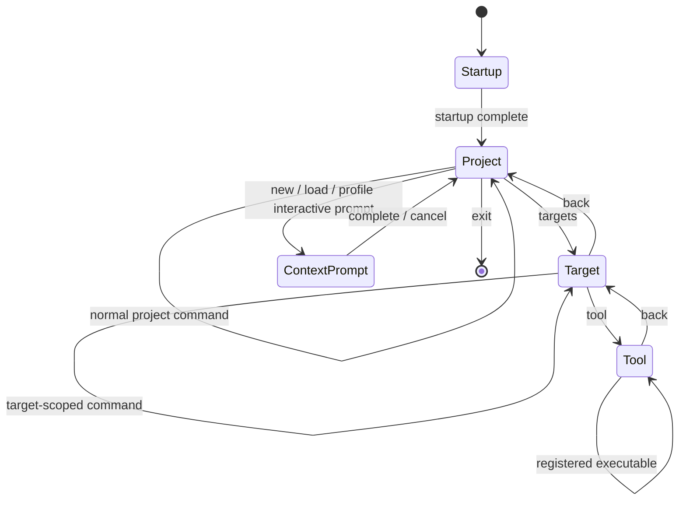

## Shared state and NOSIX boundary

[`src/data.h`](../src/data.h) is the central shared-state boundary. It defines the program state carried through the runtime and directly includes the public NOSIX interface.

Most top-level subsystem headers depend on `data.h`, including:

- command dispatch;
- profiles;
- projects;
- targets;
- UI;
- ping/resolve/scan;
- tools;
- the Book core through `book_core.h`.

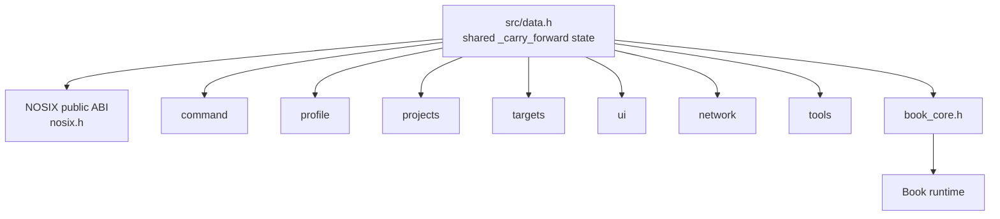

This makes `data.h` a high-impact header. Changes to its types, constants, or state ownership should be treated as cross-subsystem changes.

## Project and profile lifecycle

Project state owns the lifetime of the active NOSIX network runtime.

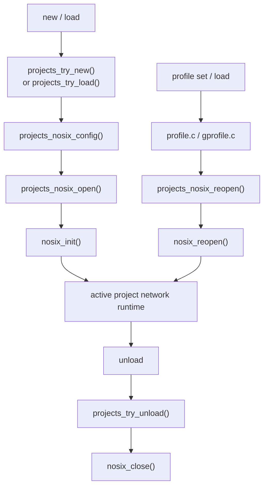

Key ownership rules:

| Event | Owner | NOSIX action |
| --- | --- | --- |
| Project creation | `projects_try_new()` | initialize project-bound NOSIX runtime |
| Project load | `projects_try_load()` | initialize project-bound NOSIX runtime |
| Active profile change | profile layer + `projects_nosix_reopen()` | reconfigure active NOSIX runtime |
| Project unload | `projects_try_unload()` | close NOSIX runtime |

The profile layer does not create a second network stack. It updates configuration and delegates active network reconfiguration back to the project layer.

## Network execution paths

Kaminowaku-native network activity stays inside the Kaminowaku/NOSIX boundary.

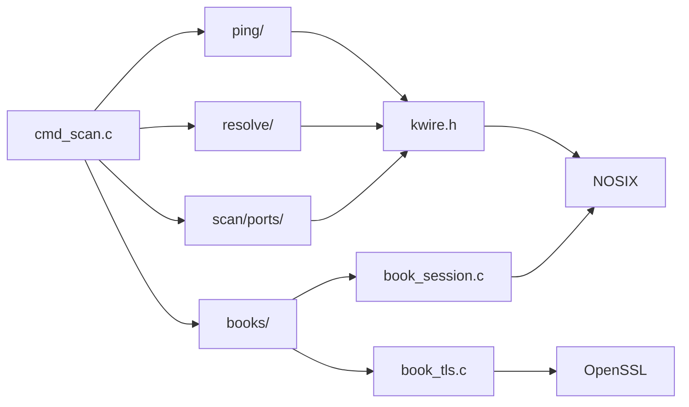

### Native path ownership

| Path | Entry | Transport boundary |
| --- | --- | --- |
| ICMPv4 | `ksping_single()` / `ksping_multi()` | KWIRE + NOSIX |
| ICMPv6 | ping dispatcher into `ksping6.c` | KWIRE + NOSIX |
| DNS | `kresolve_single()` / `kresolve_multi()` | KWIRE + NOSIX |
| TCP/UDP port scan | `kportscan_run()` | KWIRE + NOSIX |
| Book TCP/UDP | Book native API | `book_session.c` + NOSIX |
| Book TLS | Book native API | `book_tls.c` + OpenSSL over Book transport |

External tools are deliberately outside this accounting path.

## Port-scan path

The port scanner separates command parsing/orchestration from protocol-specific execution and result enrichment.

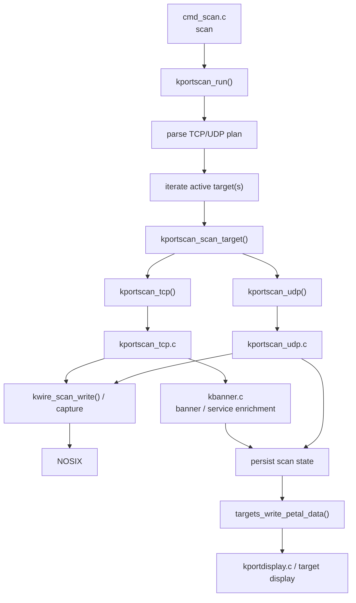

Supporting scan infrastructure:

| Component | Responsibility |
| --- | --- |
| [`kscan.c`](../src/network/scan/kscan.c) | shared scan/capture support |
| [`kscan6.c`](../src/network/scan/kscan6.c) | IPv6 scan support |
| [`kscan_dispatch.c`](../src/network/scan/kscan_dispatch.c) | dispatch infrastructure |
| [`kworker.c`](../src/network/scan/kworker.c) | scan worker support |
| [`kwire.h`](../src/network/scan/kwire.h) | Kaminowaku network/evidence bridge into NOSIX |
| [`kportscan.c`](../src/network/scan/ports/kportscan.c) | scan plan, target iteration, pacing, PCAP/result orchestration |
| [`kportscan_tcp.c`](../src/network/scan/ports/kportscan_tcp.c) | TCP scan execution |
| [`kportscan_udp.c`](../src/network/scan/ports/kportscan_udp.c) | UDP scan execution |
| [`kbanner.c`](../src/network/scan/ports/kbanner.c) | TCP banner/service enrichment |
| [`kportdisplay.c`](../src/network/scan/ports/kportdisplay.c) | persisted port-result display |

## Book execution path

Books have a separate language/runtime stack, but their network and evidence lifecycle remains native and bounded.

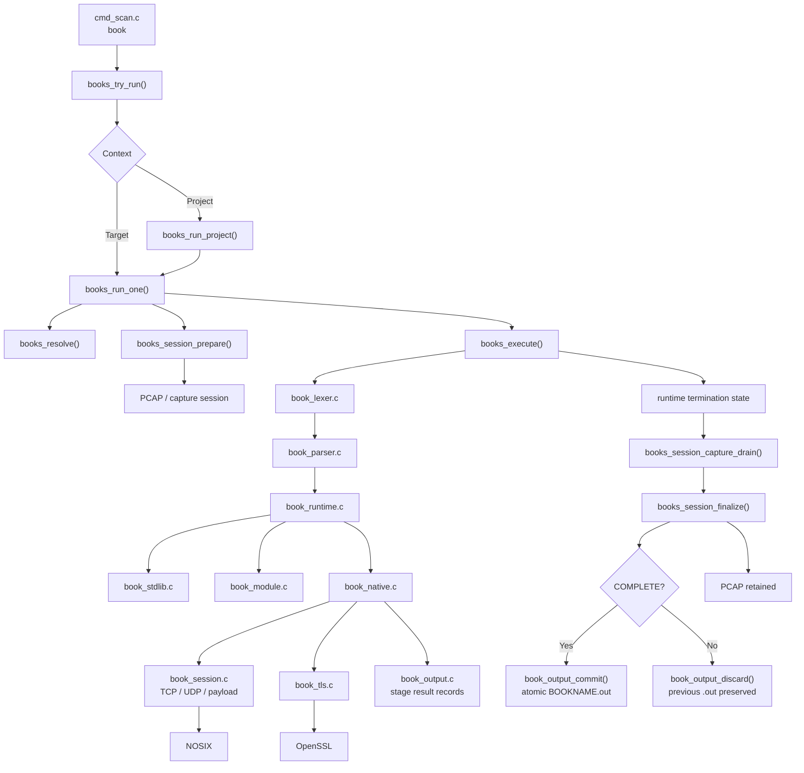

### Book source/runtime relationship

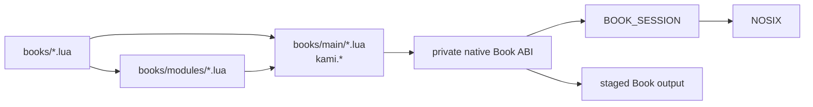

The corresponding language and module contract is documented in [`BOOK_LANGUAGE_V1.md`](BOOK_LANGUAGE_V1.md).

## External-tool path

External tools are intentionally separated from Kaminowaku-native packet execution.

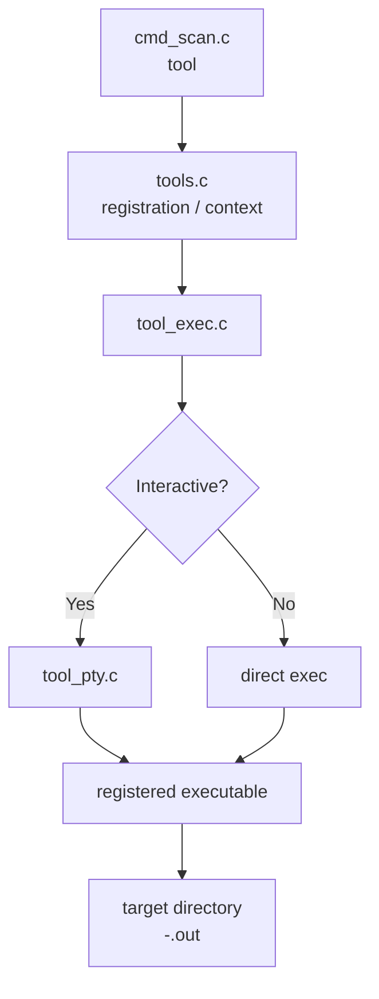

The external-tool path does **not**:

- create a Kaminowaku PCAP session;
- pass network traffic through NOSIX on Kaminowaku's behalf;
- update Kaminowaku-native TX/RX counters.

## Persistence and evidence

The active project and target model connects network execution to durable evidence.

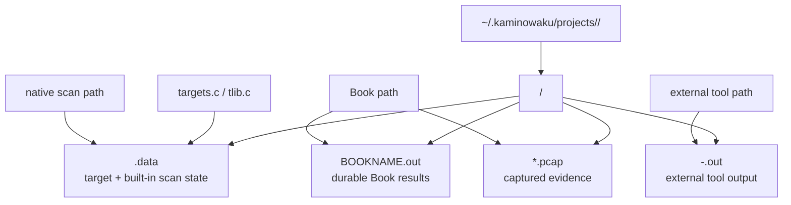

Persistence ownership:

| Artifact | Primary owner |
| --- | --- |
| Target metadata / scan state | `targets.c`, `tlib.c`, scan subsystem |
| Built-in port data | port-scan subsystem persisted through target state |
| Book result snapshot | `book_output.c` + `book_persist.c` |
| Book PCAP | `book_session.c` |
| External-tool raw output | `tool_exec.c` / `tool_pty.c` |
| Runtime log | UI/runtime logging path |

## UI and rendering path

Input and output are deliberately separated.

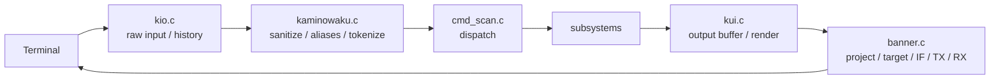

| UI file | Primary role |
| --- | --- |
| [`kio.c`](../src/ui/kio.c) | terminal input, raw-mode behavior, command history |
| [`kui.c`](../src/ui/kui.c) | output accumulation and page rendering |
| [`banner.c`](../src/ui/banner.c) | top banner and active runtime/project status |
| [`kui_guard.c`](../src/ui/kui_guard.c) | UI guard/invariant support |

Subsystems generally write through `kui_add_line()` or `kui_add_line_and_render()` rather than writing directly to the terminal.

## Build-time link path

Kaminowaku compiles from the recursive `src/` tree, projects headers into the generated staging tree, and links against NOSIX and OpenSSL.

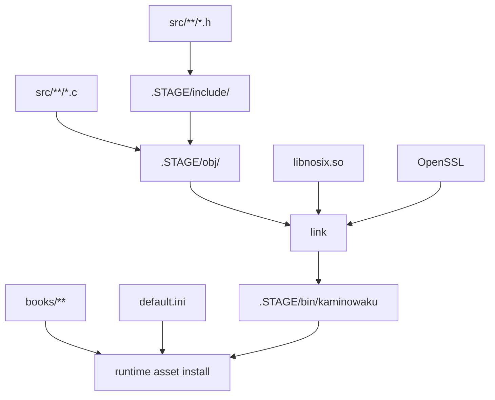

The staged header projection means duplicate header basenames are a build hazard even when their source directories differ.

## Implementation link index

The following tables list the **direct Kaminowaku headers included by each implementation file**. Standard-library and platform headers are omitted here.

### Runtime and command

| Implementation | Direct local links |
| --- | --- |
| [`src/main.c`](../src/main.c) | `kaminowaku.h`, `data.h` |
| [`src/kaminowaku.c`](../src/kaminowaku.c) | `kaminowaku.h`, `cmd_scan.h`, `gprofile.h`, `helpers.h`, `banner.h`, `kio.h`, `kui.h` |
| [`src/helpers.c`](../src/helpers.c) | `helpers.h` |
| [`src/command/cmd_guard.c`](../src/command/cmd_guard.c) | `cmd_scan.h`, `kui.h` |
| [`src/command/cmd_scan.c`](../src/command/cmd_scan.c) | `kui.h`, `help.h`, `cmd_scan.h`, `helpers.h`, `projects.h`, `targets.h`, `interfaces.h`, `profile.h`, `ksping.h`, `kresolve.h`, `kportscan.h`, `books.h`, `tools.h`, `tool_exec.h` |
| [`src/command/help.c`](../src/command/help.c) | `help.h`, `kui.h` |

### Profiles, projects, and targets

| Implementation | Direct local links |
| --- | --- |
| [`src/profile/gprofile.c`](../src/profile/gprofile.c) | `gprofile.h`, `helpers.h` |
| [`src/profile/profile.c`](../src/profile/profile.c) | `profile.h`, `gprofile.h`, `projects.h`, `kui.h` |
| [`src/projects/projects.c`](../src/projects/projects.c) | `projects.h`, `helpers.h`, `kui.h` |
| [`src/targets/targets.c`](../src/targets/targets.c) | `targets.h`, `tlib.h`, `helpers.h`, `kui.h`, `kportdisplay.h`, `kscan.h`, `book_persist.h` |
| [`src/targets/targets_guard.c`](../src/targets/targets_guard.c) | `targets.h` |
| [`src/targets/tlib.c`](../src/targets/tlib.c) | `tlib.h`, `helpers.h`, `kui.h`, `kscan.h` |

### UI

| Implementation | Direct local links |
| --- | --- |
| [`src/ui/banner.c`](../src/ui/banner.c) | `banner.h`, `helpers.h`, `kscan.h` |
| [`src/ui/kio.c`](../src/ui/kio.c) | `kio.h`, `kui.h` |
| [`src/ui/kui.c`](../src/ui/kui.c) | `kui.h`, `banner.h`, `helpers.h` |
| [`src/ui/kui_guard.c`](../src/ui/kui_guard.c) | `kui.h` |

### Network

| Implementation | Direct local links |
| --- | --- |
| [`interfaces.c`](../src/network/interfaces/interfaces.c) | `interfaces.h`, `kui.h` |
| [`ksping.c`](../src/network/ping/ksping.c) | `ksping.h`, `kwire.h`, `helpers.h`, `kui.h`, `tlib.h` |
| [`ksping6.c`](../src/network/ping/ksping6.c) | `ksping.h`, `kwire.h`, `kui.h`, `kscan.h` |
| [`kresolve.c`](../src/network/resolve/kresolve.c) | `kresolve.h`, `kwire.h`, `kui.h`, `tlib.h` |
| [`kscan.c`](../src/network/scan/kscan.c) | `kscan.h`, `kscan_dispatch.h`, `kscan_internal.h`, `kwire.h`, `tlib.h` |
| [`kscan6.c`](../src/network/scan/kscan6.c) | `kscan.h`, `tlib.h` |
| [`kscan_dispatch.c`](../src/network/scan/kscan_dispatch.c) | `kscan_dispatch.h`, `kscan_internal.h` |
| [`kworker.c`](../src/network/scan/kworker.c) | `kworker.h` |
| [`kbanner.c`](../src/network/scan/ports/kbanner.c) | `kbanner.h`, `kportscan_internal.h`, `kscan.h`, `kui.h` |
| [`kportdisplay.c`](../src/network/scan/ports/kportdisplay.c) | `kportdisplay.h`, `kportscan.h`, `kbanner.h`, `kscan.h`, `kui.h` |
| [`kportscan.c`](../src/network/scan/ports/kportscan.c) | `kportscan.h`, `kbanner.h`, `kportscan_internal.h`, `kscan.h`, `kui.h`, `tlib.h` |
| [`kportscan_tcp.c`](../src/network/scan/ports/kportscan_tcp.c) | `kportscan_internal.h`, `kscan.h`, `kui.h` |
| [`kportscan_udp.c`](../src/network/scan/ports/kportscan_udp.c) | `kportscan_internal.h`, `kscan.h`, `kui.h` |

### Books

| Implementation | Direct local links |
| --- | --- |
| [`books.c`](../src/books/books.c) | `books.h`, `book_session.h`, `book_exec.h`, `book_output.h`, `book_persist.h`, `book_audit.h`, `tlib.h`, `kui.h` |
| [`book_core.c`](../src/books/book_core.c) | `book_core.h` |
| [`book_audit.c`](../src/books/book_audit.c) | `book_audit.h`, `helpers.h` |
| [`book_exec.c`](../src/books/book_exec.c) | `book_exec.h`, `book_audit.h`, `book_runtime.h`, `kui.h` |
| [`book_lexer.c`](../src/books/book_lexer.c) | `book_lexer.h` |
| [`book_parser.c`](../src/books/book_parser.c) | `book_parser.h` |
| [`book_runtime.c`](../src/books/book_runtime.c) | `book_runtime.h`, `book_stdlib.h`, `book_module.h`, `book_native.h` |
| [`book_stdlib.c`](../src/books/book_stdlib.c) | `book_stdlib.h` |
| [`book_module.c`](../src/books/book_module.c) | `book_module.h` |
| [`book_native.c`](../src/books/book_native.c) | `book_native.h`, `book_audit.h`, `book_output.h`, `book_tls.h`, `kui.h` |
| [`book_session.c`](../src/books/book_session.c) | `book_session.h`, `book_audit.h` |
| [`book_tls.c`](../src/books/book_tls.c) | `book_tls.h` |
| [`book_output.c`](../src/books/book_output.c) | `book_output.h` |
| [`book_persist.c`](../src/books/book_persist.c) | `book_persist.h`, `book_output.h`, `kui.h` |

### External tools

| Implementation | Direct local links |
| --- | --- |
| [`tools.c`](../src/tools/tools.c) | `tools.h`, `kui.h` |
| [`tool_exec.c`](../src/tools/tool_exec.c) | `tool_exec.h`, `tool_pty.h`, `kui.h` |
| [`tool_pty.c`](../src/tools/tool_pty.c) | `tool_pty.h`, `kui.h` |

## Change-impact guide

This is the practical inverse of the link graph: start with the boundary being changed, then inspect the dependent paths before considering the change complete.

| Change area | Inspect next |
| --- | --- |
| `data.h` state/layout | virtually every subsystem header; startup zeroing; persistence/versioned structures |
| Command enum / `f_type` | `data.h`, `kaminowaku.c`, `cmd_scan.c`, `help.c`, aliases |
| New command | `cmd_scan.c`, `help.c`, alias handling if applicable, context guards |
| Project lifecycle | `projects.c`, NOSIX open/reopen/close ownership, profile interactions |
| Profile field | `default.ini`, `gprofile.c`, `profile.c`, `projects_nosix_config()`, README |
| Target field | `data.h`, `targets.c`, `tlib.c`, target persistence/display |
| Native network accounting | `kwire.h`, relevant ping/resolve/scan path, banner TX/RX display |
| TCP/UDP scan behavior | `kportscan.c`, protocol file, `kscan*`, `kwire.h`, persistence/display |
| Banner/service enrichment | `kbanner.c`, scan result structures, `kportdisplay.c` |
| Book language syntax | lexer, parser, runtime, stdlib/module/native layers, Book language documentation |
| Book network primitive | `book_native.c`, `book_session.c`, audit, output, PCAP lifecycle |
| Book result persistence | `book_output.c`, `book_persist.c`, `books.c`, target display |
| Book core module | `books/main/`, native private ABI if required, installer asset checks |
| Protocol module | `books/modules/`, dependent system Books, language reference |
| UI output semantics | `kui.c`, `banner.c`, subsystem notice sites |
| Input/history behavior | `kio.c`, `kaminowaku.c` sanitization/tokenization |
| External-tool execution | `tools.c`, `tool_exec.c`, `tool_pty.c`, target output handling |
| Source/header movement | `Makefile`, staged header basename uniqueness, installer source checks |
| Runtime asset movement | `install.sh`, README paths, Book/module resolver assumptions |

## External dependency boundary

Kaminowaku intentionally keeps a small set of major external runtime/build dependencies.

| Dependency | Kaminowaku boundary |
| --- | --- |
| **NOSIX** | low-level network runtime, capture/transport support, public ABI consumed by Kaminowaku |
| **OpenSSL** | TLS implementation for native Book TLS support and TLS-aware enumeration |
| **POSIX / OS APIs** | filesystem, terminal, process, PTY, interface, and platform socket primitives |
| **External tools** | separately executed user-registered binaries; not part of native NOSIX accounting |

The two most important architectural boundaries are:

```text
Kaminowaku native network path
        -> KWIRE / BOOK_SESSION
        -> NOSIX

Book TLS path
        -> BOOK_SESSION transport
        -> book_tls
        -> OpenSSL
```

Keeping those ownership boundaries intact prevents network behavior from leaking into command/UI code and prevents the Book runtime from creating an independent unmanaged network stack.

## Vendored dependency packaging (Phase 1)

`libs/nosix/` contains the licensed Linux/FreeBSD amd64 NOSIX ABI, including public headers and manifests. `libs/openssl/` contains the pinned OpenSSL 3.5.8 source, matching native static libraries, generated per-OS headers and license. The `--offline` mode uses only the pinned static OpenSSL archives and verified prebuilt native executable; it neither discovers system OpenSSL nor calls a package manager. The developer-only `libs/openssl/build-native.sh` prepares static OpenSSL from a verified source archive. The `--online` mode does **not** require the vendored OpenSSL archive or libraries: it optionally acquires missing prerequisites with the host package manager and compiles Kaminowaku against OS-managed OpenSSL 3 shared libraries using pkg-config/pkgconf. Both paths stage NOSIX privately, retain license and ABI integrity checks, and avoid global NOSIX/SSL replacements.
